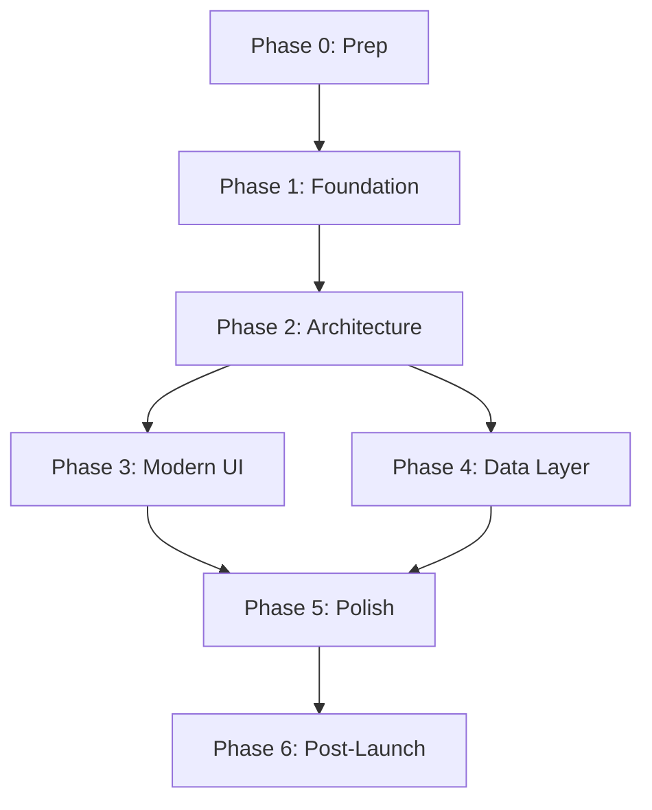

# Brief App - Modernization Roadmap

**Version**: 1.0
**Last Updated**: November 4, 2025
**Target Completion**: 8-10 weeks

---

## 📋 Table of Contents

1. [Vision & Goals](#vision--goals)
2. [Success Criteria](#success-criteria)
3. [Phased Implementation Plan](#phased-implementation-plan)
4. [Detailed Phase Breakdown](#detailed-phase-breakdown)
5. [Migration Strategy](#migration-strategy)
6. [Risk Mitigation](#risk-mitigation)
7. [Resource Requirements](#resource-requirements)
8. [Timeline & Milestones](#timeline--milestones)

---

## 🎯 Vision & Goals

### Primary Vision
Transform Brief from a legacy Android app into a modern, maintainable, and scalable news aggregation platform following current Android development best practices.

### Strategic Goals

1. **Architectural Excellence**
   - Implement clean, testable architecture (MVVM/Clean)
   - Achieve >80% code coverage
   - Zero static singletons

2. **Modern Tech Stack**
   - 100% Kotlin codebase
   - Jetpack Compose UI
   - Coroutines + Flow for async operations
   - Hilt for dependency injection

3. **User Experience**
   - Offline-first approach
   - Faster load times with caching
   - Smooth animations and transitions
   - Better error handling

4. **Developer Experience**
   - Easy to add new features
   - Comprehensive documentation
   - Automated testing
   - CI/CD pipeline

5. **Code Quality**
   - Maintainable codebase
   - Consistent code style
   - Zero technical debt markers (TODOs)
   - Modern tooling

---

## ✅ Success Criteria

### Technical Metrics

| Metric | Current | Target | Status |
|--------|---------|--------|--------|
| Kotlin Coverage | 8% | 100% | 🔴 |
| Code Coverage | <20% | >80% | 🔴 |
| Build Time | Unknown | <2 min | - |
| APK Size | Unknown | -30% | - |
| Crash-free Rate | Unknown | >99% | - |
| Architecture Pattern | MVC | MVVM/Clean | 🔴 |
| Dependency Injection | None | Hilt | 🔴 |
| UI Framework | XML | Compose | 🔴 |

### Quality Gates

- ✅ All tests passing
- ✅ Zero compiler warnings
- ✅ ktlint checks passing
- ✅ detekt checks passing
- ✅ No critical security vulnerabilities
- ✅ ProGuard/R8 enabled
- ✅ CI/CD pipeline green

### User-Facing Improvements

- ⚡ 50% faster initial load time (with caching)
- 📱 Offline mode functional
- 🎨 Modern Material 3 design
- 🔄 Pull-to-refresh implemented
- 🔍 Search functionality added
- 🔖 Bookmarking capability
- 📤 Share functionality

---

## 🗺️ Phased Implementation Plan

### Overview

The modernization will be executed in 6 phases over 8-10 weeks, with each phase delivering incremental value while maintaining app functionality.

```
Phase 0: Preparation (Week 0)
    ↓
Phase 1: Foundation (Weeks 1-2)
    ↓
Phase 2: Architecture (Weeks 3-4)
    ↓
Phase 3: Modern UI (Weeks 5-6)
    ↓
Phase 4: Data Layer (Week 7)
    ↓
Phase 5: Polish & Launch (Week 8)
    ↓
Phase 6: Post-Launch (Ongoing)
```

### Phase Dependencies



---

## 📅 Detailed Phase Breakdown

---

## Phase 0: Preparation (Week 0)

**Goal**: Set up foundational tooling and project infrastructure

**Duration**: 3-5 days

### Tasks

#### 0.1 Project Setup

- [ ] Add Gradle wrapper
  ```bash
  gradle wrapper --gradle-version 8.10
  ```
- [ ] Create `.gitignore` improvements
- [ ] Set up branch strategy (main, develop, feature/*)
- [ ] Create project documentation structure

#### 0.2 Build Configuration

- [ ] Create `gradle/libs.versions.toml` (version catalog)
  ```toml
  [versions]
  kotlin = "2.0.0"
  compose = "1.7.5"
  hilt = "2.51.1"
  # ... etc
  ```
- [ ] Update `build.gradle.kts` to use version catalog
- [ ] Configure ProGuard/R8 rules (keep disabled until Phase 5)
- [ ] Add dependency update plugin (Renovate or Dependabot)

#### 0.3 Code Quality Tools

- [ ] Add ktlint
  ```kotlin
  plugins {
      id("org.jlleitschuh.gradle.ktlint") version "12.1.0"
  }
  ```
- [ ] Add detekt
  ```kotlin
  plugins {
      id("io.gitlab.arturbosch.detekt") version "1.23.5"
  }
  ```
- [ ] Configure code style (create `.editorconfig`)
- [ ] Run initial ktlint/detekt baseline
- [ ] Add pre-commit hooks (optional)

#### 0.4 CI/CD Setup

- [ ] Create `.github/workflows/ci.yml`
  - Build debug and release
  - Run unit tests
  - Run ktlint/detekt
  - Upload test reports
- [ ] Create `.github/workflows/pr.yml`
  - PR validation checks
  - Code coverage reporting
- [ ] Set up GitHub branch protection rules

#### 0.5 Documentation

- [ ] Create CONTRIBUTING.md
- [ ] Create DEVELOPMENT.md (setup instructions)
- [ ] Update README.md with modern content
- [ ] Create CHANGELOG.md

**Deliverables**:
- ✅ Gradle wrapper files
- ✅ Version catalog configured
- ✅ Code quality tools running
- ✅ CI/CD pipeline active
- ✅ Documentation updated

**Success Metrics**:
- CI pipeline runs successfully
- ktlint/detekt baseline established
- Build reproducible on any machine

---

## Phase 1: Foundation (Weeks 1-2)

**Goal**: Establish modern foundation without breaking existing functionality

**Duration**: 2 weeks

### Tasks

#### 1.1 Dependency Injection Setup

- [ ] Add Hilt dependencies
  ```kotlin
  implementation("com.google.dagger:hilt-android:2.51.1")
  kapt("com.google.dagger:hilt-compiler:2.51.1")
  ```
- [ ] Annotate `WikiApplication` with `@HiltAndroidApp`
- [ ] Create initial Hilt modules structure:
  ```
  di/
  ├── AppModule.kt
  ├── NetworkModule.kt
  └── DataModule.kt
  ```
- [ ] Migrate static singletons to Hilt `@Singleton`
- [ ] Inject dependencies into Activities/Fragments

#### 1.2 Logging & Utilities

- [ ] Replace custom Logger with Timber
  ```kotlin
  implementation("com.jakewharton.timber:timber:5.0.1")
  ```
- [ ] Migrate logging calls: `Logger.d() → Timber.d()`
- [ ] Convert utility classes to Kotlin:
  - [x] ArrayUtil.kt (already done)
  - [x] UrlParamEncoder.kt (already done)
  - [ ] Utils.java → Utils.kt
  - [ ] Constants.java → Constants.kt

#### 1.3 Convert Data Models

- [ ] Convert `WikiData.java` to Kotlin data class
  ```kotlin
  data class WikiData(
      val data: String,
      val dataType: DataType
  ) {
      enum class DataType { HEADER, POST }
  }
  ```
- [ ] Add Parcelize for state preservation
- [ ] Create sealed class for UI state
  ```kotlin
  sealed class UiState {
      data object Loading : UiState()
      data class Success(val data: List<WikiData>) : UiState()
      data class Error(val message: String) : UiState()
  }
  ```

#### 1.4 Network Layer Modernization

- [ ] Add Retrofit dependencies
  ```kotlin
  implementation("com.squareup.retrofit2:retrofit:2.11.0")
  implementation("com.squareup.retrofit2:converter-scalars:2.11.0")
  ```
- [ ] Create Retrofit service interface
  ```kotlin
  interface WikipediaService {
      @GET("wiki/Portal:Current_events")
      suspend fun getCurrentEvents(): String
  }
  ```
- [ ] Configure OkHttp with Hilt
  ```kotlin
  @Provides
  @Singleton
  fun provideOkHttpClient(): OkHttpClient { ... }
  ```
- [ ] Add logging interceptor in debug builds only

#### 1.5 Manager Classes Conversion

- [ ] Convert `PreferencesManager.java` → Kotlin
  - Inject Context via Hilt
  - Use Kotlin property delegates
  - Consider DataStore migration (optional)
- [ ] Convert `WikiCookieManager.java` → Kotlin
  - Inject via Hilt

#### 1.6 Testing Foundation

- [ ] Add testing dependencies
  ```kotlin
  testImplementation("org.jetbrains.kotlinx:kotlinx-coroutines-test:1.8.0")
  testImplementation("app.cash.turbine:turbine:1.1.0")
  testImplementation("io.mockk:mockk:1.13.10")
  testImplementation("com.google.dagger:hilt-android-testing:2.51.1")
  ```
- [ ] Create test utility classes
- [ ] Set up test coroutine dispatcher
- [ ] Create fake/mock implementations

**Deliverables**:
- ✅ Hilt fully integrated
- ✅ Timber for logging
- ✅ Retrofit for networking
- ✅ Core models in Kotlin
- ✅ Testing infrastructure ready

**Success Metrics**:
- App still compiles and runs
- All existing functionality works
- CI pipeline passes
- Zero new bugs introduced

---

## Phase 2: Architecture (Weeks 3-4)

**Goal**: Implement MVVM/Clean Architecture

**Duration**: 2 weeks

### Architecture Layers

```
presentation/
├── ui/                     (Composables/Fragments)
├── viewmodel/              (ViewModels)
└── mapper/                 (Domain → UI models)

domain/
├── usecase/                (Use cases)
├── model/                  (Domain models)
└── repository/             (Repository interfaces)

data/
├── repository/             (Repository implementations)
├── datasource/
│   ├── remote/             (Network data source)
│   └── local/              (Database data source)
├── mapper/                 (Data → Domain models)
└── model/                  (DTOs)
```

### Tasks

#### 2.1 Domain Layer

- [ ] Create domain models
  ```kotlin
  data class NewsArticle(
      val title: String,
      val content: String,
      val url: String,
      val timestamp: Long
  )

  data class NewsSection(
      val header: String,
      val articles: List<NewsArticle>
  )
  ```

- [ ] Define repository interfaces
  ```kotlin
  interface NewsRepository {
      suspend fun getCurrentEvents(): Result<List<NewsSection>>
      fun getCurrentEventsFlow(): Flow<List<NewsSection>>
  }
  ```

- [ ] Create use cases
  ```kotlin
  class GetCurrentEventsUseCase @Inject constructor(
      private val repository: NewsRepository
  ) {
      suspend operator fun invoke(): Result<List<NewsSection>> =
          repository.getCurrentEvents()
  }

  class ObserveCurrentEventsUseCase @Inject constructor(
      private val repository: NewsRepository
  ) {
      operator fun invoke(): Flow<List<NewsSection>> =
          repository.getCurrentEventsFlow()
  }
  ```

#### 2.2 Data Layer

- [ ] Move HTML parsing to data layer
  ```kotlin
  class WikipediaHtmlParser @Inject constructor() {
      fun parse(html: String): List<NewsSection> {
          // Move logic from WikiNewsFragment
      }
  }
  ```

- [ ] Create data sources
  ```kotlin
  interface NewsRemoteDataSource {
      suspend fun fetchCurrentEvents(): String
  }

  class NewsRemoteDataSourceImpl @Inject constructor(
      private val wikipediaService: WikipediaService,
      private val parser: WikipediaHtmlParser
  ) : NewsRemoteDataSource {
      override suspend fun fetchCurrentEvents(): String =
          wikipediaService.getCurrentEvents()
  }
  ```

- [ ] Implement repository
  ```kotlin
  class NewsRepositoryImpl @Inject constructor(
      private val remoteDataSource: NewsRemoteDataSource,
      private val parser: WikipediaHtmlParser,
      private val ioDispatcher: CoroutineDispatcher
  ) : NewsRepository {
      override suspend fun getCurrentEvents(): Result<List<NewsSection>> =
          withContext(ioDispatcher) {
              try {
                  val html = remoteDataSource.fetchCurrentEvents()
                  val sections = parser.parse(html)
                  Result.success(sections)
              } catch (e: Exception) {
                  Result.failure(e)
              }
          }
  }
  ```

#### 2.3 Presentation Layer

- [ ] Create ViewModel
  ```kotlin
  @HiltViewModel
  class NewsViewModel @Inject constructor(
      private val getCurrentEventsUseCase: GetCurrentEventsUseCase
  ) : ViewModel() {

      private val _uiState = MutableStateFlow<UiState>(UiState.Loading)
      val uiState: StateFlow<UiState> = _uiState.asStateFlow()

      init {
          loadNews()
      }

      fun loadNews() {
          viewModelScope.launch {
              _uiState.value = UiState.Loading
              getCurrentEventsUseCase()
                  .onSuccess { sections ->
                      _uiState.value = UiState.Success(sections)
                  }
                  .onFailure { error ->
                      _uiState.value = UiState.Error(error.message ?: "Unknown error")
                  }
          }
      }

      fun retry() = loadNews()
  }
  ```

- [ ] Update Fragment to use ViewModel (temporary, before Compose)
  ```kotlin
  @AndroidEntryPoint
  class WikiNewsFragment : Fragment() {
      private val viewModel: NewsViewModel by viewModels()

      override fun onViewCreated(view: View, savedInstanceState: Bundle?) {
          super.onViewCreated(view, savedInstanceState)

          viewLifecycleOwner.lifecycleScope.launch {
              viewLifecycleOwner.repeatOnLifecycle(Lifecycle.State.STARTED) {
                  viewModel.uiState.collect { state ->
                      when (state) {
                          is UiState.Loading -> showLoading()
                          is UiState.Success -> showContent(state.sections)
                          is UiState.Error -> showError(state.message)
                      }
                  }
              }
          }
      }
  }
  ```

#### 2.4 Convert Activities/Fragments to Kotlin

- [ ] Convert `BaseActivity.java` → `BaseActivity.kt`
- [ ] Convert `WikiToolbarActivity.java` → `WikiToolbarActivity.kt`
- [ ] Convert `WikiActivity.java` → `WikiActivity.kt`
- [ ] Convert `WikiFragment.java` → `WikiFragment.kt`
- [ ] Convert `WikiNewsFragment.java` → `WikiNewsFragment.kt`
- [ ] Convert `WikiAdapter.java` → `WikiAdapter.kt`

#### 2.5 Convert Remaining Java Files

- [ ] Dialog fragments → Kotlin
- [ ] ViewHolders → Kotlin
- [ ] Custom views → Kotlin
- [ ] Application class → Kotlin (remove static singleton)

#### 2.6 Testing

- [ ] Write ViewModel tests
  ```kotlin
  @Test
  fun `loadNews success updates state`() = runTest {
      // Given
      val expectedSections = listOf(/* test data */)
      coEvery { getCurrentEventsUseCase() } returns Result.success(expectedSections)

      // When
      val viewModel = NewsViewModel(getCurrentEventsUseCase)

      // Then
      viewModel.uiState.test {
          assertEquals(UiState.Loading, awaitItem())
          assertEquals(UiState.Success(expectedSections), awaitItem())
      }
  }
  ```

- [ ] Write repository tests
- [ ] Write use case tests
- [ ] Write parser tests

**Deliverables**:
- ✅ 100% Kotlin codebase
- ✅ Clean Architecture implemented
- ✅ ViewModels managing UI state
- ✅ Repository pattern in place
- ✅ Comprehensive unit tests
- ✅ Zero static singletons

**Success Metrics**:
- Code coverage >70%
- All tests passing
- App functionality identical to before
- No memory leaks

---

## Phase 3: Modern UI (Weeks 5-6)

**Goal**: Migrate from XML layouts to Jetpack Compose

**Duration**: 2 weeks

### Tasks

#### 3.1 Compose Setup

- [ ] Add Compose dependencies
  ```kotlin
  implementation(platform("androidx.compose:compose-bom:2024.10.01"))
  implementation("androidx.compose.ui:ui")
  implementation("androidx.compose.ui:ui-tooling-preview")
  implementation("androidx.compose.material3:material3")
  implementation("androidx.compose.material:material-icons-extended")
  implementation("androidx.activity:activity-compose:1.9.3")
  implementation("androidx.navigation:navigation-compose:2.8.4")
  implementation("androidx.hilt:hilt-navigation-compose:1.2.0")

  debugImplementation("androidx.compose.ui:ui-tooling")
  debugImplementation("androidx.compose.ui:ui-test-manifest")
  ```

- [ ] Enable Compose in `build.gradle.kts`
  ```kotlin
  buildFeatures {
      compose = true
  }
  composeOptions {
      kotlinCompilerExtensionVersion = "1.5.15"
  }
  ```

#### 3.2 Design System

- [ ] Create Material 3 theme
  ```kotlin
  @Composable
  fun BriefTheme(
      darkTheme: Boolean = isSystemInDarkTheme(),
      content: @Composable () -> Unit
  ) {
      val colorScheme = if (darkTheme) darkColorScheme() else lightColorScheme()

      MaterialTheme(
          colorScheme = colorScheme,
          typography = Typography,
          content = content
      )
  }
  ```

- [ ] Define color scheme
- [ ] Define typography
- [ ] Create reusable components
  ```kotlin
  @Composable
  fun NewsArticleCard(article: NewsArticle, onClick: () -> Unit) { ... }

  @Composable
  fun SectionHeader(text: String) { ... }

  @Composable
  fun LoadingIndicator() { ... }

  @Composable
  fun ErrorView(message: String, onRetry: () -> Unit) { ... }
  ```

#### 3.3 Screen Implementation

- [ ] Create main news screen
  ```kotlin
  @Composable
  fun NewsScreen(
      viewModel: NewsViewModel = hiltViewModel()
  ) {
      val uiState by viewModel.uiState.collectAsStateWithLifecycle()

      NewsScreenContent(
          uiState = uiState,
          onRetry = viewModel::retry,
          onArticleClick = { /* navigate */ }
      )
  }

  @Composable
  private fun NewsScreenContent(
      uiState: UiState,
      onRetry: () -> Unit,
      onArticleClick: (NewsArticle) -> Unit
  ) {
      when (uiState) {
          UiState.Loading -> LoadingIndicator()
          is UiState.Success -> NewsContent(uiState.sections, onArticleClick)
          is UiState.Error -> ErrorView(uiState.message, onRetry)
      }
  }
  ```

- [ ] Implement lazy list
  ```kotlin
  @Composable
  fun NewsContent(
      sections: List<NewsSection>,
      onArticleClick: (NewsArticle) -> Unit
  ) {
      LazyColumn(
          modifier = Modifier.fillMaxSize(),
          contentPadding = PaddingValues(16.dp)
      ) {
          sections.forEach { section ->
              item(key = section.header) {
                  SectionHeader(section.header)
              }
              items(
                  items = section.articles,
                  key = { it.url }
              ) { article →
                  NewsArticleCard(article, onClick = { onArticleClick(article) })
              }
          }
      }
  }
  ```

- [ ] Add pull-to-refresh
  ```kotlin
  val pullRefreshState = rememberPullRefreshState(
      refreshing = uiState is UiState.Loading,
      onRefresh = { viewModel.loadNews() }
  )
  ```

#### 3.4 Navigation

- [ ] Set up Navigation Compose
  ```kotlin
  @Composable
  fun BriefNavHost(
      navController: NavHostController = rememberNavController()
  ) {
      NavHost(
          navController = navController,
          startDestination = "news"
      ) {
          composable("news") {
              NewsScreen()
          }
          // Future: article detail, settings, etc.
      }
  }
  ```

#### 3.5 Activity Migration

- [ ] Convert `WikiActivity` to Compose activity
  ```kotlin
  @AndroidEntryPoint
  class MainActivity : ComponentActivity() {
      override fun onCreate(savedInstanceState: Bundle?) {
          super.onCreate(savedInstanceState)
          setContent {
              BriefTheme {
                  Surface(
                      modifier = Modifier.fillMaxSize(),
                      color = MaterialTheme.colorScheme.background
                  ) {
                      BriefNavHost()
                  }
              }
          }
      }
  }
  ```

#### 3.6 Remove XML Layouts

- [ ] Delete unused layout files
- [ ] Delete ViewHolder classes
- [ ] Delete custom views (LoadingViewFlipper, etc.)
- [ ] Delete RecyclerView adapter
- [ ] Clean up resources

#### 3.7 UI Testing

- [ ] Add Compose UI test dependencies
  ```kotlin
  androidTestImplementation("androidx.compose.ui:ui-test-junit4")
  ```

- [ ] Write UI tests
  ```kotlin
  @Test
  fun newsScreen_showsLoadingState() {
      composeTestRule.setContent {
          NewsScreenContent(
              uiState = UiState.Loading,
              onRetry = {},
              onArticleClick = {}
          )
      }

      composeTestRule.onNodeWithText("Loading").assertIsDisplayed()
  }
  ```

**Deliverables**:
- ✅ 100% Compose UI
- ✅ Material 3 design system
- ✅ Zero XML layouts
- ✅ Pull-to-refresh implemented
- ✅ Smooth animations
- ✅ UI tests passing

**Success Metrics**:
- UI tests >60% coverage
- No performance regressions
- Better UX than before

---

## Phase 4: Data Layer (Week 7)

**Goal**: Add offline support with Room and WorkManager

**Duration**: 1 week

### Tasks

#### 4.1 Room Database

- [ ] Add Room dependencies
  ```kotlin
  implementation("androidx.room:room-runtime:2.6.1")
  implementation("androidx.room:room-ktx:2.6.1")
  ksp("androidx.room:room-compiler:2.6.1")
  ```

- [ ] Create entities
  ```kotlin
  @Entity(tableName = "news_articles")
  data class NewsArticleEntity(
      @PrimaryKey val url: String,
      val title: String,
      val content: String,
      val section: String,
      val timestamp: Long,
      val cachedAt: Long = System.currentTimeMillis()
  )
  ```

- [ ] Create DAOs
  ```kotlin
  @Dao
  interface NewsDao {
      @Query("SELECT * FROM news_articles ORDER BY timestamp DESC")
      fun getAllArticles(): Flow<List<NewsArticleEntity>>

      @Insert(onConflict = OnConflictStrategy.REPLACE)
      suspend fun insertArticles(articles: List<NewsArticleEntity>)

      @Query("DELETE FROM news_articles WHERE cachedAt < :expiryTime")
      suspend fun deleteExpiredArticles(expiryTime: Long)

      @Query("DELETE FROM news_articles")
      suspend fun clearAll()
  }
  ```

- [ ] Create database
  ```kotlin
  @Database(
      entities = [NewsArticleEntity::class],
      version = 1,
      exportSchema = true
  )
  abstract class BriefDatabase : RoomDatabase() {
      abstract fun newsDao(): NewsDao
  }
  ```

- [ ] Provide via Hilt
  ```kotlin
  @Module
  @InstallIn(SingletonComponent::class)
  object DatabaseModule {
      @Provides
      @Singleton
      fun provideDatabase(@ApplicationContext context: Context): BriefDatabase =
          Room.databaseBuilder(
              context,
              BriefDatabase::class.java,
              "brief_database"
          ).build()

      @Provides
      fun provideNewsDao(database: BriefDatabase): NewsDao =
          database.newsDao()
  }
  ```

#### 4.2 Local Data Source

- [ ] Create local data source
  ```kotlin
  interface NewsLocalDataSource {
      fun getArticles(): Flow<List<NewsArticleEntity>>
      suspend fun saveArticles(articles: List<NewsArticleEntity>)
      suspend fun clearArticles()
  }

  class NewsLocalDataSourceImpl @Inject constructor(
      private val newsDao: NewsDao
  ) : NewsLocalDataSource {
      override fun getArticles(): Flow<List<NewsArticleEntity>> =
          newsDao.getAllArticles()

      override suspend fun saveArticles(articles: List<NewsArticleEntity>) =
          newsDao.insertArticles(articles)

      override suspend fun clearArticles() =
          newsDao.clearAll()
  }
  ```

#### 4.3 Offline-First Repository

- [ ] Update repository to use cache
  ```kotlin
  class NewsRepositoryImpl @Inject constructor(
      private val remoteDataSource: NewsRemoteDataSource,
      private val localDataSource: NewsLocalDataSource,
      private val parser: WikipediaHtmlParser,
      @IoDispatcher private val ioDispatcher: CoroutineDispatcher
  ) : NewsRepository {

      override fun getCurrentEventsFlow(): Flow<List<NewsSection>> =
          localDataSource.getArticles()
              .map { entities -> entities.toSections() }
              .flowOn(ioDispatcher)

      override suspend fun getCurrentEvents(): Result<List<NewsSection>> =
          withContext(ioDispatcher) {
              try {
                  // Fetch from network
                  val html = remoteDataSource.fetchCurrentEvents()
                  val sections = parser.parse(html)

                  // Save to cache
                  localDataSource.saveArticles(sections.toEntities())

                  Result.success(sections)
              } catch (e: Exception) {
                  Result.failure(e)
              }
          }

      override suspend fun refreshNews(): Result<Unit> =
          getCurrentEvents().map { }
  }
  ```

#### 4.4 WorkManager for Background Sync

- [ ] Add WorkManager dependency
  ```kotlin
  implementation("androidx.work:work-runtime-ktx:2.9.1")
  implementation("androidx.hilt:hilt-work:1.2.0")
  ksp("androidx.hilt:hilt-compiler:1.2.0")
  ```

- [ ] Create sync worker
  ```kotlin
  @HiltWorker
  class NewsSyncWorker @AssistedInject constructor(
      @Assisted context: Context,
      @Assisted params: WorkerParameters,
      private val repository: NewsRepository
  ) : CoroutineWorker(context, params) {

      override suspend fun doWork(): Result {
          return try {
              repository.refreshNews().getOrThrow()
              Result.success()
          } catch (e: Exception) {
              if (runAttemptCount < 3) {
                  Result.retry()
              } else {
                  Result.failure()
              }
          }
      }
  }
  ```

- [ ] Schedule periodic sync
  ```kotlin
  @Module
  @InstallIn(SingletonComponent::class)
  object WorkManagerModule {
      @Provides
      @Singleton
      fun provideWorkManager(@ApplicationContext context: Context): WorkManager =
          WorkManager.getInstance(context)
  }

  // In Application.onCreate()
  fun scheduleNewsSyncWork() {
      val constraints = Constraints.Builder()
          .setRequiredNetworkType(NetworkType.CONNECTED)
          .build()

      val syncWork = PeriodicWorkRequestBuilder<NewsSyncWorker>(
          repeatInterval = 6,
          repeatIntervalTimeUnit = TimeUnit.HOURS
      )
          .setConstraints(constraints)
          .build()

      WorkManager.getInstance(applicationContext)
          .enqueueUniquePeriodicWork(
              "news_sync",
              ExistingPeriodicWorkPolicy.KEEP,
              syncWork
          )
  }
  ```

#### 4.5 Update ViewModel

- [ ] Update to use Flow
  ```kotlin
  @HiltViewModel
  class NewsViewModel @Inject constructor(
      private val observeCurrentEventsUseCase: ObserveCurrentEventsUseCase,
      private val refreshNewsUseCase: RefreshNewsUseCase
  ) : ViewModel() {

      val uiState: StateFlow<UiState> = observeCurrentEventsUseCase()
          .map<List<NewsSection>, UiState> { UiState.Success(it) }
          .catch { emit(UiState.Error(it.message ?: "Unknown error")) }
          .stateIn(
              scope = viewModelScope,
              started = SharingStarted.WhileSubscribed(5000),
              initialValue = UiState.Loading
          )

      fun refresh() {
          viewModelScope.launch {
              refreshNewsUseCase()
          }
      }
  }
  ```

**Deliverables**:
- ✅ Room database for caching
- ✅ Offline-first architecture
- ✅ Background sync with WorkManager
- ✅ Reactive data flow
- ✅ Better UX with instant loads

**Success Metrics**:
- App works offline
- Load time <100ms from cache
- Background sync working
- No data loss

---

## Phase 5: Polish & Launch (Week 8)

**Goal**: Production-ready app with optimizations

**Duration**: 1 week

### Tasks

#### 5.1 Performance Optimization

- [ ] Enable R8/ProGuard
  ```kotlin
  buildTypes {
      release {
          isMinifyEnabled = true
          isShrinkResources = true
          proguardFiles(
              getDefaultProguardFile("proguard-android-optimize.txt"),
              "proguard-rules.pro"
          )
      }
  }
  ```

- [ ] Configure ProGuard rules
- [ ] Baseline profile (optional)
- [ ] Profile app with profiler
- [ ] Fix any memory leaks
- [ ] Optimize images/resources

#### 5.2 Security Improvements

- [ ] Remove Apache HTTP legacy
  ```kotlin
  // Delete: useLibrary("org.apache.http.legacy")
  ```

- [ ] Add network security config
  ```xml
  <!-- res/xml/network_security_config.xml -->
  <network-security-config>
      <base-config cleartextTrafficPermitted="false" />
  </network-security-config>
  ```

- [ ] Add backup rules
  ```xml
  <!-- res/xml/backup_rules.xml -->
  <full-backup-content>
      <exclude domain="sharedpref" path="sensitive_prefs.xml"/>
  </full-backup-content>
  ```

- [ ] Certificate pinning (optional)
- [ ] Enable StrictMode in debug

#### 5.3 Analytics & Monitoring

- [ ] Add Firebase Crashlytics
  ```kotlin
  implementation("com.google.firebase:firebase-crashlytics-ktx")
  implementation("com.google.firebase:firebase-analytics-ktx")
  ```

- [ ] Add crash reporting
- [ ] Add performance monitoring
- [ ] Add analytics events
- [ ] Test crash reporting

#### 5.4 Final Testing

- [ ] Run full test suite
- [ ] Manual QA testing
- [ ] Test on different devices
- [ ] Test different Android versions
- [ ] Test offline scenarios
- [ ] Test background sync
- [ ] Beta test with users (optional)

#### 5.5 Documentation

- [ ] Update README.md
- [ ] Complete CHANGELOG.md
- [ ] API documentation (KDoc)
- [ ] Architecture diagrams
- [ ] User guide (if needed)

#### 5.6 Clean Up

- [ ] Remove all TODOs
- [ ] Remove commented code
- [ ] Fix all compiler warnings
- [ ] Clean up unused resources
- [ ] Update dependencies to latest stable
- [ ] Final ktlint/detekt run

#### 5.7 Release Preparation

- [ ] Update version to 2.0
- [ ] Generate signed APK/AAB
- [ ] Test release build
- [ ] Prepare Play Store listing
- [ ] Screenshot new UI
- [ ] Write release notes

**Deliverables**:
- ✅ Production-ready app
- ✅ All tests passing
- ✅ Zero warnings
- ✅ Security hardened
- ✅ Monitoring enabled
- ✅ Documentation complete

**Success Metrics**:
- APK size reduced by 30%
- Build time <2 minutes
- Zero crashes in testing
- All quality gates passing

---

## Phase 6: Post-Launch (Ongoing)

**Goal**: Continuous improvement and feature additions

### Tasks

#### 6.1 Immediate Post-Launch

- [ ] Monitor crash reports
- [ ] Monitor analytics
- [ ] Gather user feedback
- [ ] Fix critical bugs (if any)
- [ ] Performance tuning based on metrics

#### 6.2 Future Enhancements

Priority 1 (Next 1-2 months):
- [ ] Search functionality
- [ ] Bookmarking/favorites
- [ ] Share functionality
- [ ] Dark theme improvements
- [ ] Widget

Priority 2 (3-6 months):
- [ ] Multiple news sources
- [ ] Customizable feeds
- [ ] Notifications for breaking news
- [ ] Article reader mode
- [ ] Export/backup functionality

Priority 3 (6+ months):
- [ ] User accounts/sync
- [ ] Comments/community
- [ ] Personalization/ML
- [ ] Tablet/foldable optimization
- [ ] Wear OS companion app

#### 6.3 Maintenance

- [ ] Monthly dependency updates
- [ ] Quarterly security audits
- [ ] Performance monitoring
- [ ] User support
- [ ] Bug fixes

---

## 🎯 Migration Strategy

### Incremental Migration Approach

We will use the **Strangler Fig Pattern** to gradually replace old code with new:

1. **Coexistence**: New architecture runs alongside old code
2. **Incremental**: Migrate feature by feature
3. **No Big Bang**: App remains functional throughout
4. **Reversible**: Can roll back if issues arise

### Code Organization During Migration

```
app/src/main/java/com/techventus/wikipedianews/
├── legacy/                    # Old code (Phase 1-2)
│   └── (moved here temporarily)
├── data/                      # New architecture (Phase 2+)
├── domain/
├── presentation/
└── di/
```

### Testing Strategy

```
For each phase:
1. Write tests for new code first (TDD)
2. Ensure old functionality still works
3. Add integration tests
4. Run regression testing
5. Only delete old code when new is proven
```

---

## ⚠️ Risk Mitigation

### Technical Risks

| Risk | Probability | Impact | Mitigation |
|------|-------------|--------|------------|
| Breaking changes during migration | High | High | Incremental approach, comprehensive testing |
| Performance regression | Medium | High | Profiling, benchmarking, load testing |
| Third-party dependency issues | Medium | Medium | Pin versions, test before upgrading |
| Wikipedia HTML changes | Low | Critical | Monitor, add alerts, have fallback |
| Data loss during Room migration | Low | Critical | Thorough testing, backups, migration tests |
| Memory leaks | Medium | Medium | LeakCanary, profiling, code review |

### Mitigation Strategies

1. **Feature Flags**
   ```kotlin
   object FeatureFlags {
       val useNewArchitecture = BuildConfig.DEBUG
       val useCompose = BuildConfig.DEBUG
   }
   ```

2. **Rollback Plan**
   - Keep old code until new is proven (2-4 weeks)
   - Tag each phase in git
   - Document rollback procedures

3. **Monitoring**
   - Crashlytics for crash monitoring
   - Analytics for usage tracking
   - Performance monitoring
   - Error logging

4. **Testing Coverage**
   - Unit tests >80%
   - Integration tests for critical paths
   - UI tests for main flows
   - Manual QA testing

---

## 📊 Resource Requirements

### Development Time

| Phase | Duration | Effort (Days) |
|-------|----------|---------------|
| Phase 0 | 3-5 days | 3-5 |
| Phase 1 | 2 weeks | 10 |
| Phase 2 | 2 weeks | 10 |
| Phase 3 | 2 weeks | 10 |
| Phase 4 | 1 week | 5 |
| Phase 5 | 1 week | 5 |
| **Total** | **8-9 weeks** | **43-48 days** |

### Team Composition

**Recommended**:
- 1 Senior Android Developer (full-time)
- 1 QA Engineer (part-time, phases 2-5)
- 1 Designer (part-time, phase 3)

**Alternative** (Solo):
- 1 Developer can complete in 8-10 weeks working full-time

### Tools & Services

**Required**:
- ✅ Android Studio (latest)
- ✅ Git + GitHub
- ✅ GitHub Actions (free tier)

**Recommended**:
- Firebase (free tier) - Crashlytics, Analytics
- LeakCanary - Memory leak detection
- Renovate/Dependabot - Dependency updates

**Optional**:
- Sentry - Advanced error tracking
- Firebase Remote Config - Feature flags
- App Distribution - Beta testing

---

## 📅 Timeline & Milestones

### Gantt Chart Overview

```
Week 0:  [Phase 0: Preparation        ]
Week 1:  [Phase 1: Foundation         ]
Week 2:  [Phase 1: Foundation         ]
Week 3:  [Phase 2: Architecture       ]
Week 4:  [Phase 2: Architecture       ]
Week 5:  [Phase 3: Modern UI          ]
Week 6:  [Phase 3: Modern UI          ]
Week 7:  [Phase 4: Data Layer         ]
Week 8:  [Phase 5: Polish & Launch    ]
Week 9+: [Phase 6: Post-Launch        ]
```

### Key Milestones

| Milestone | Week | Success Criteria |
|-----------|------|------------------|
| 🏁 M1: Foundation Complete | 2 | Hilt, Retrofit, 50% Kotlin |
| 🏁 M2: Architecture Complete | 4 | MVVM, 100% Kotlin, Repository |
| 🏁 M3: UI Modernized | 6 | 100% Compose, Material 3 |
| 🏁 M4: Offline Support | 7 | Room, WorkManager, offline mode |
| 🏁 M5: Production Ready | 8 | R8 enabled, tests pass, documented |
| 🏁 M6: App Launch | 9 | Published to Play Store |

### Phase Gates

Each phase must meet these criteria before proceeding:

✅ **Phase Gate Checklist**:
- [ ] All phase tasks completed
- [ ] Tests passing (>80% coverage for that phase)
- [ ] Code review completed
- [ ] No critical bugs
- [ ] Documentation updated
- [ ] CI/CD pipeline green
- [ ] Stakeholder approval (if applicable)

---

## 🎓 Learning Resources

### For Team Members

**Architecture**:
- [Guide to app architecture](https://developer.android.com/topic/architecture)
- [Clean Architecture](https://blog.cleancoder.com/uncle-bob/2012/08/13/the-clean-architecture.html)

**Jetpack Compose**:
- [Compose pathway](https://developer.android.com/courses/pathways/compose)
- [Thinking in Compose](https://developer.android.com/jetpack/compose/mental-model)

**Coroutines & Flow**:
- [Kotlin Coroutines guide](https://kotlinlang.org/docs/coroutines-guide.html)
- [StateFlow and SharedFlow](https://developer.android.com/kotlin/flow/stateflow-and-sharedflow)

**Hilt**:
- [Dependency injection with Hilt](https://developer.android.com/training/dependency-injection/hilt-android)

**Room**:
- [Room persistence library](https://developer.android.com/training/data-storage/room)

---

## 📈 Success Tracking

### KPIs to Monitor

**Technical KPIs**:
- Code coverage: Target >80%
- Build time: Target <2 minutes
- APK size: Target <10MB
- Crash-free rate: Target >99%
- ANR rate: Target <0.1%

**User KPIs**:
- App startup time: Target <1 second
- Screen load time: Target <100ms (from cache)
- User retention (Day 1/7/30)
- Average session duration
- Feature adoption rate

**Development KPIs**:
- Velocity (story points per sprint)
- Bug resolution time
- Code review time
- Deployment frequency

### Reporting

**Weekly Status Report Template**:
```markdown
## Week X Status

### Completed
- Task 1
- Task 2

### In Progress
- Task 3 (70% complete)

### Blocked
- Task 4 (waiting on X)

### Metrics
- Code coverage: X%
- Tests: X passing, Y failing
- Build time: X minutes

### Next Week
- Focus area
- Key tasks
```

---

## 🔄 Continuous Improvement

### Post-Modernization

After completion, establish ongoing practices:

1. **Monthly**
   - Dependency updates
   - Security scan
   - Performance review

2. **Quarterly**
   - Architecture review
   - Technical debt assessment
   - Technology radar update

3. **Annually**
   - Major version planning
   - Technology stack evaluation
   - Team skill assessment

---

## 📞 Support & Questions

### Decision Log

Track important decisions:

| Date | Decision | Rationale | Owner |
|------|----------|-----------|-------|
| 2025-11-04 | Use MVVM over MVI | Simpler, team familiar | TBD |
| 2025-11-04 | Jetpack Compose over XML | Modern, better DX | TBD |
| - | - | - | - |

### Change Requests

Process for scope changes:

1. Document requested change
2. Assess impact (time, risk, value)
3. Update roadmap if approved
4. Communicate to stakeholders

---

## ✅ Summary

This roadmap provides a comprehensive, phased approach to modernizing the Brief app. The key principles are:

1. **Incremental**: No big bang rewrites
2. **Tested**: Comprehensive testing at each phase
3. **Reversible**: Can roll back if needed
4. **Pragmatic**: Focus on value delivery
5. **Sustainable**: Maintainable long-term

**Total Timeline**: 8-10 weeks
**Expected Outcome**: Modern, maintainable, production-ready Android app

---

**Ready to start? Let's begin with Phase 0!** 🚀
