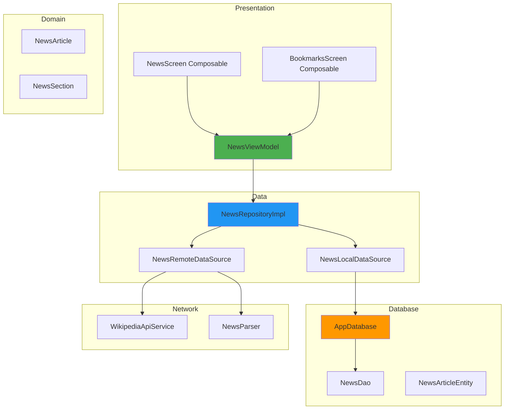
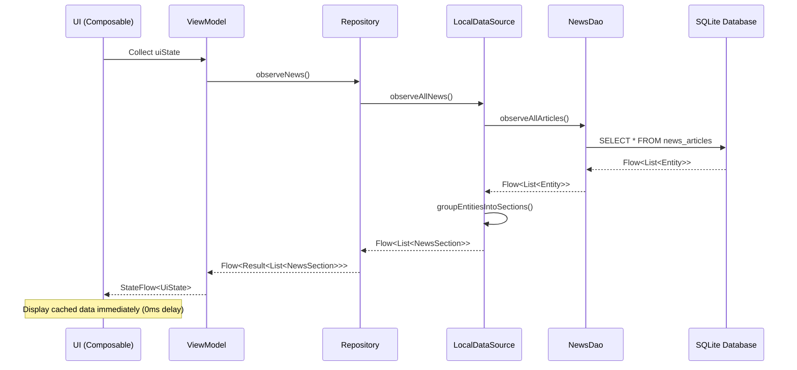
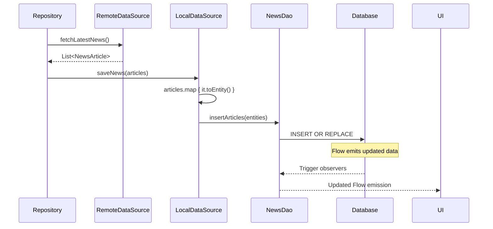
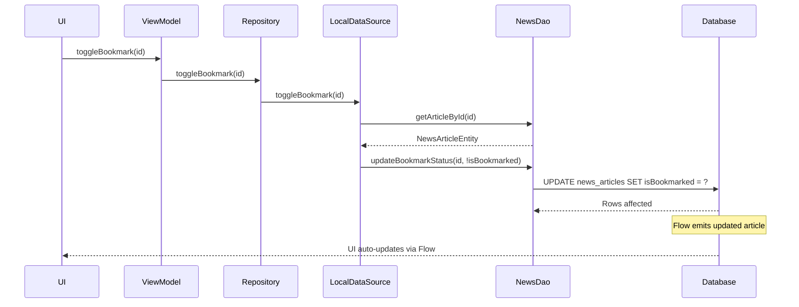

# Database Integration Documentation

## Overview

This document describes how the **Brief** application integrates with the Room database, detailing the architecture patterns, data flow, common query patterns, transaction boundaries, and concurrency handling strategies.

---

## Table of Contents

1. [Architecture Overview](#architecture-overview)
2. [Layer Responsibilities](#layer-responsibilities)
3. [Data Flow Patterns](#data-flow-patterns)
4. [Dependency Injection](#dependency-injection)
5. [Common Query Patterns](#common-query-patterns)
6. [Transaction Boundaries](#transaction-boundaries)
7. [Concurrency Handling](#concurrency-handling)
8. [Error Handling](#error-handling)
9. [Testing Integration](#testing-integration)
10. [Best Practices](#best-practices)

---

## Architecture Overview

### Clean Architecture Layers



### Package Structure

```
com.techventus.wikipedianews/
├── presentation/
│   ├── viewmodel/
│   │   └── NewsViewModel.kt
│   └── ui/
│       ├── NewsScreen.kt
│       ├── BookmarksScreen.kt
│       └── ArticleDetailScreen.kt
├── model/
│   ├── domain/
│   │   ├── NewsArticle.kt
│   │   └── NewsSection.kt
│   ├── database/
│   │   ├── AppDatabase.kt
│   │   ├── entity/
│   │   │   └── NewsArticleEntity.kt
│   │   └── dao/
│   │       └── NewsDao.kt
│   ├── datasource/
│   │   ├── NewsLocalDataSource.kt
│   │   └── NewsRemoteDataSource.kt
│   └── repository/
│       ├── NewsRepository.kt
│       └── NewsRepositoryImpl.kt
└── inject/
    └── DatabaseModule.kt
```

---

## Layer Responsibilities

### 1. Presentation Layer

**Location**: `presentation/`

**Components**:
- `NewsViewModel`: Manages UI state, coordinates repository calls
- UI screens: Display data, handle user interactions

**Responsibilities**:
- Observe data from repository via Flow
- Transform data for UI display
- Handle user actions (bookmark, search, refresh)
- Manage loading/error states

**Database Interaction**: None (uses repository)

**Example**:
```kotlin
@HiltViewModel
class NewsViewModel @Inject constructor(
    private val repository: NewsRepository
) : ViewModel() {

    private val _uiState = MutableStateFlow<NewsUiState>(NewsUiState.Loading)
    val uiState: StateFlow<NewsUiState> = _uiState.asStateFlow()

    init {
        observeNews()
    }

    private fun observeNews() {
        viewModelScope.launch {
            repository.observeNews()
                .collect { result ->
                    _uiState.value = when {
                        result.isSuccess -> NewsUiState.Success(result.getOrNull() ?: emptyList())
                        result.isFailure -> NewsUiState.Error(result.exceptionOrNull()?.message)
                        else -> NewsUiState.Loading
                    }
                }
        }
    }

    fun toggleBookmark(articleId: String) {
        viewModelScope.launch {
            repository.toggleBookmark(articleId)
        }
    }
}
```

### 2. Domain Layer

**Location**: `model/domain/`

**Components**:
- `NewsArticle`: Business logic model
- `NewsSection`: Grouped articles for UI

**Responsibilities**:
- Define business entities
- No database dependencies
- Pure Kotlin data classes

**Example**:
```kotlin
data class NewsArticle(
    val id: String,
    val title: String,
    val htmlContent: String,
    val url: String,
    val timestamp: Long,
    val isBookmarked: Boolean
)

data class NewsSection(
    val header: String,
    val articles: List<NewsArticle>
)
```

### 3. Data Layer - Repository

**Location**: `model/repository/`

**Components**:
- `NewsRepository`: Interface defining data operations
- `NewsRepositoryImpl`: Implementation coordinating local + remote data

**Responsibilities**:
- Implement offline-first strategy
- Coordinate local and remote data sources
- Handle errors gracefully
- Transform entities to domain models

**Database Interaction**: Via `NewsLocalDataSource`

**Example**:
```kotlin
class NewsRepositoryImpl @Inject constructor(
    private val localDataSource: NewsLocalDataSource,
    private val remoteDataSource: NewsRemoteDataSource
) : NewsRepository {

    override fun observeNews(): Flow<Result<List<NewsSection>>> {
        return localDataSource.observeAllNews()
            .onStart {
                // Trigger background refresh
                refreshNews()
            }
            .catch { e ->
                emit(Result.failure(e))
            }
            .map { sections ->
                Result.success(sections)
            }
    }

    override suspend fun refreshNews(): Result<Unit> {
        return try {
            val freshArticles = remoteDataSource.fetchLatestNews()
            localDataSource.saveNews(freshArticles)
            Result.success(Unit)
        } catch (e: Exception) {
            Result.failure(e)
        }
    }

    override suspend fun toggleBookmark(articleId: String) {
        localDataSource.toggleBookmark(articleId)
    }
}
```

### 4. Data Layer - Data Sources

#### Local Data Source

**Location**: `model/datasource/NewsLocalDataSource.kt`

**Responsibilities**:
- Wrap Room DAO operations
- Transform entities ↔ domain models
- Group articles by section
- Provide Flow-based reactive queries

**Database Interaction**: Direct DAO access

**Example**:
```kotlin
class NewsLocalDataSource @Inject constructor(
    private val newsDao: NewsDao
) {
    fun observeAllNews(): Flow<List<NewsSection>> {
        return newsDao.observeAllArticles()
            .map { entities -> groupEntitiesIntoSections(entities) }
    }

    fun observeBookmarkedNews(): Flow<List<NewsSection>> {
        return newsDao.observeBookmarkedArticles()
            .map { entities -> groupEntitiesIntoSections(entities) }
    }

    suspend fun saveNews(articles: List<NewsArticle>, sectionHeader: String = "News") {
        val entities = articles.map { it.toEntity(sectionHeader) }
        newsDao.insertArticles(entities)
    }

    suspend fun toggleBookmark(articleId: String) {
        val article = newsDao.getArticleById(articleId)
        article?.let {
            newsDao.updateBookmarkStatus(articleId, !it.isBookmarked)
        }
    }

    private fun groupEntitiesIntoSections(entities: List<NewsArticleEntity>): List<NewsSection> {
        return entities
            .groupBy { it.sectionHeader }
            .map { (header, articles) ->
                NewsSection(
                    header = header,
                    articles = articles.map { it.toDomain() }
                )
            }
    }
}
```

#### Remote Data Source

**Location**: `model/datasource/NewsRemoteDataSource.kt`

**Responsibilities**:
- Fetch data from Wikipedia API
- Parse HTML content
- Transform to domain models

**Database Interaction**: None

### 5. Database Layer

**Location**: `model/database/`

**Components**:
- `AppDatabase`: Room database singleton
- `NewsDao`: Data access interface
- `NewsArticleEntity`: Database entity

**Responsibilities**:
- Define database schema
- Provide query methods
- Handle database operations

**Example**:
```kotlin
@Dao
interface NewsDao {
    @Query("SELECT * FROM news_articles ORDER BY timestamp DESC")
    fun observeAllArticles(): Flow<List<NewsArticleEntity>>

    @Insert(onConflict = OnConflictStrategy.REPLACE)
    suspend fun insertArticles(articles: List<NewsArticleEntity>)

    @Query("UPDATE news_articles SET isBookmarked = :isBookmarked WHERE id = :articleId")
    suspend fun updateBookmarkStatus(articleId: String, isBookmarked: Boolean)
}
```

---

## Data Flow Patterns

### Pattern 1: Offline-First Read



**Key Points**:
- Database emits cached data immediately
- Flow automatically updates UI when data changes
- No network calls block initial render

### Pattern 2: Background Refresh



**Key Points**:
- Refresh happens in background
- REPLACE strategy prevents duplicates
- Flow observers notified automatically

### Pattern 3: User Action (Bookmark)



**Key Points**:
- Single UPDATE query
- Optimistic UI update (instant feedback)
- Flow ensures UI consistency

---

## Dependency Injection

### Hilt Module Configuration

**Location**: `inject/DatabaseModule.kt`

```kotlin
@Module
@InstallIn(SingletonComponent::class)
object DatabaseModule {

    @Provides
    @Singleton
    fun provideAppDatabase(
        @ApplicationContext context: Context
    ): AppDatabase {
        return Room.databaseBuilder(
            context,
            AppDatabase::class.java,
            AppDatabase.DATABASE_NAME
        )
        .fallbackToDestructiveMigration()
        .build()
    }

    @Provides
    @Singleton
    fun provideNewsDao(database: AppDatabase): NewsDao {
        return database.newsDao()
    }
}
```

### Dependency Graph

```mermaid
graph TD
    A[@HiltAndroidApp]
    B[SingletonComponent]
    C[AppDatabase @Singleton]
    D[NewsDao @Singleton]
    E[NewsLocalDataSource]
    F[NewsRemoteDataSource]
    G[NewsRepositoryImpl]
    H[NewsViewModel]

    A --> B
    B --> C
    C --> D
    D --> E
    F --> G
    E --> G
    G --> H

    style C fill:#4CAF50
    style D fill:#2196F3
    style G fill:#FF9800
```

**Scopes**:
- `@Singleton`: AppDatabase, NewsDao (one instance per app)
- `@ViewModelScoped`: NewsViewModel (recreated on config change)
- Default: DataSources, Repository (new instance per injection)

**Benefits**:
- Single database instance (prevents conflicts)
- Easy testing (can inject mocks)
- Lazy initialization (created on first use)

---

## Common Query Patterns

### Pattern 1: Reactive UI Updates

```kotlin
// ViewModel
class NewsViewModel @Inject constructor(
    private val repository: NewsRepository
) : ViewModel() {

    val news: StateFlow<List<NewsSection>> = repository.observeNews()
        .map { it.getOrDefault(emptyList()) }
        .stateIn(
            scope = viewModelScope,
            started = SharingStarted.WhileSubscribed(5000),
            initialValue = emptyList()
        )
}

// UI
@Composable
fun NewsScreen(viewModel: NewsViewModel = hiltViewModel()) {
    val news by viewModel.news.collectAsState()

    LazyColumn {
        news.forEach { section ->
            item {
                SectionHeader(section.header)
            }
            items(section.articles) { article ->
                ArticleCard(article)
            }
        }
    }
}
```

**Benefits**:
- Automatic UI updates on data changes
- No manual refresh needed
- Memory-efficient (collects only when UI visible)

### Pattern 2: Search with Debounce

```kotlin
class NewsViewModel @Inject constructor(
    private val repository: NewsRepository
) : ViewModel() {

    private val searchQuery = MutableStateFlow("")

    val searchResults: StateFlow<List<NewsSection>> = searchQuery
        .debounce(300) // Wait 300ms after user stops typing
        .distinctUntilChanged()
        .flatMapLatest { query ->
            if (query.isEmpty()) {
                flowOf(emptyList())
            } else {
                repository.searchNews(query)
            }
        }
        .stateIn(
            scope = viewModelScope,
            started = SharingStarted.WhileSubscribed(),
            initialValue = emptyList()
        )

    fun onSearchQueryChanged(query: String) {
        searchQuery.value = query
    }
}
```

**Benefits**:
- Reduces unnecessary database queries
- Smooth search experience
- Cancels previous queries automatically

### Pattern 3: Conditional Data Loading

```kotlin
class NewsViewModel @Inject constructor(
    private val repository: NewsRepository
) : ViewModel() {

    val showBookmarks = MutableStateFlow(false)

    val displayedNews: StateFlow<List<NewsSection>> = showBookmarks
        .flatMapLatest { bookmarksOnly ->
            if (bookmarksOnly) {
                repository.observeBookmarkedNews()
            } else {
                repository.observeNews()
            }
        }
        .map { it.getOrDefault(emptyList()) }
        .stateIn(
            scope = viewModelScope,
            started = SharingStarted.WhileSubscribed(),
            initialValue = emptyList()
        )

    fun toggleBookmarkFilter() {
        showBookmarks.value = !showBookmarks.value
    }
}
```

**Benefits**:
- Single UI state
- Automatic query switching
- Reactive to user preference changes

### Pattern 4: Pull-to-Refresh

```kotlin
class NewsViewModel @Inject constructor(
    private val repository: NewsRepository
) : ViewModel() {

    private val _isRefreshing = MutableStateFlow(false)
    val isRefreshing: StateFlow<Boolean> = _isRefreshing.asStateFlow()

    fun refresh() {
        viewModelScope.launch {
            _isRefreshing.value = true
            repository.refreshNews()
            _isRefreshing.value = false
        }
    }
}

@Composable
fun NewsScreen(viewModel: NewsViewModel = hiltViewModel()) {
    val isRefreshing by viewModel.isRefreshing.collectAsState()

    SwipeRefresh(
        state = rememberSwipeRefreshState(isRefreshing),
        onRefresh = { viewModel.refresh() }
    ) {
        // Content
    }
}
```

---

## Transaction Boundaries

### Implicit Transactions (Room Default)

**Single DAO Operations**:
```kotlin
// Each DAO method is automatically wrapped in a transaction
newsDao.insertArticles(articles) // Transaction 1
newsDao.updateBookmarkStatus(id, true) // Transaction 2
```

### Explicit Transactions (Manual)

**Multiple Operations**:
```kotlin
// Repository method
suspend fun updateArticlesAndCleanup(
    newArticles: List<NewsArticle>,
    sectionHeader: String
) {
    database.withTransaction {
        // Operation 1: Delete old articles
        val sevenDaysAgo = System.currentTimeMillis() - (7 * 24 * 60 * 60 * 1000L)
        newsDao.deleteExpiredNonBookmarked(sevenDaysAgo)

        // Operation 2: Insert new articles
        newsDao.insertArticles(newArticles.map { it.toEntity(sectionHeader) })
    }
    // Both operations succeed or both fail (atomicity)
}
```

### Transaction Annotations

```kotlin
@Dao
interface NewsDao {
    @Transaction
    @Query("SELECT * FROM news_articles ORDER BY timestamp DESC")
    suspend fun getAllArticlesWithTransaction(): List<NewsArticleEntity>

    @Transaction
    suspend fun replaceAllArticles(newArticles: List<NewsArticleEntity>) {
        deleteAllArticles()
        insertArticles(newArticles)
    }
}
```

### Transaction Best Practices

**DO ✅**:
- Use transactions for multi-step operations
- Keep transactions short (< 100ms)
- Group related writes
- Handle transaction errors

**DON'T ❌**:
- Call suspend functions that wait for network inside transactions
- Nest transactions (Room handles this, but avoid complexity)
- Keep transactions open during long computations

**Example - Good Transaction**:
```kotlin
suspend fun bookmarkAndArchive(articleId: String) {
    database.withTransaction {
        // Fast: Single UPDATE
        newsDao.updateBookmarkStatus(articleId, true)

        // Fast: Single SELECT
        val article = newsDao.getArticleById(articleId)

        // Fast: Single INSERT
        article?.let { archiveDao.insertArticle(it) }
    }
}
```

**Example - Bad Transaction**:
```kotlin
suspend fun fetchAndSave() {
    database.withTransaction { // ❌ DON'T DO THIS
        // Slow: Network call inside transaction
        val articles = wikipediaApi.fetchNews() // Blocks transaction!

        newsDao.insertArticles(articles)
    }
}

// Correct approach
suspend fun fetchAndSave() {
    // Fast: Network call outside transaction
    val articles = wikipediaApi.fetchNews()

    // Fast: Single bulk insert
    database.withTransaction {
        newsDao.insertArticles(articles)
    }
}
```

---

## Concurrency Handling

### Room Threading Guarantees

| Operation Type | Thread | Concurrency |
|----------------|--------|-------------|
| `@Query` (Flow) | Background | Concurrent reads allowed |
| `suspend fun` (read) | Dispatchers.IO | Concurrent reads allowed |
| `suspend fun` (write) | Dispatchers.IO | Serialized (queued) |
| `@Insert/@Update/@Delete` | Dispatchers.IO | Serialized (queued) |

### Write-Ahead Logging (WAL)

**Enabled by default**: Allows concurrent reads during writes

```kotlin
// This works without blocking
launch {
    newsDao.insertArticles(newArticles) // Writing
}

launch {
    val articles = newsDao.getAllArticles() // Reading (concurrent)
}
```

**Benefits**:
- Reads don't block on writes
- Writes don't block reads
- Better multi-threaded performance

### Concurrent Operations Example

```kotlin
class NewsRepository {
    suspend fun synchronizeData() {
        coroutineScope {
            // All operations run concurrently
            launch { newsDao.deleteExpiredArticles(threshold) }
            launch { newsDao.vacuum() } // Cleanup
            launch { backupDatabase() } // Backup

            // Wait for all to complete
        }
    }
}
```

### Flow-Based Concurrency

```kotlin
// Multiple collectors can observe same Flow concurrently
class NewsViewModel : ViewModel() {
    init {
        // Collector 1: Update main UI
        viewModelScope.launch {
            repository.observeNews().collect { news ->
                _mainUiState.value = news
            }
        }

        // Collector 2: Update badge count
        viewModelScope.launch {
            repository.observeBookmarkedNews().collect { bookmarks ->
                _badgeCount.value = bookmarks.size
            }
        }
    }
}
```

### Race Condition Prevention

```kotlin
// ❌ Race condition: Two coroutines toggling same bookmark
launch { repository.toggleBookmark("abc123") } // Read isBookmarked = false
launch { repository.toggleBookmark("abc123") } // Read isBookmarked = false
// Both set to true (should be false)

// ✅ Solution 1: Use Mutex
private val bookmarkMutex = Mutex()

suspend fun toggleBookmark(articleId: String) {
    bookmarkMutex.withLock {
        val article = newsDao.getArticleById(articleId)
        article?.let {
            newsDao.updateBookmarkStatus(articleId, !it.isBookmarked)
        }
    }
}

// ✅ Solution 2: Use specific state (better)
suspend fun setBookmark(articleId: String, isBookmarked: Boolean) {
    newsDao.updateBookmarkStatus(articleId, isBookmarked)
}
```

---

## Error Handling

### Repository-Level Error Handling

```kotlin
class NewsRepositoryImpl : NewsRepository {

    override fun observeNews(): Flow<Result<List<NewsSection>>> {
        return localDataSource.observeAllNews()
            .catch { e ->
                Log.e("Repository", "Database error", e)
                emit(Result.failure(e))
            }
            .map { sections ->
                Result.success(sections)
            }
    }

    override suspend fun refreshNews(): Result<Unit> {
        return try {
            val articles = remoteDataSource.fetchLatestNews()
            localDataSource.saveNews(articles)
            Result.success(Unit)
        } catch (e: IOException) {
            Log.e("Repository", "Network error", e)
            Result.failure(e)
        } catch (e: SQLiteException) {
            Log.e("Repository", "Database error", e)
            Result.failure(e)
        }
    }
}
```

### ViewModel-Level Error Handling

```kotlin
class NewsViewModel : ViewModel() {

    private val _uiState = MutableStateFlow<NewsUiState>(NewsUiState.Loading)
    val uiState: StateFlow<NewsUiState> = _uiState.asStateFlow()

    fun refresh() {
        viewModelScope.launch {
            _uiState.value = NewsUiState.Loading

            repository.refreshNews()
                .onSuccess {
                    // Success is handled via Flow updates
                }
                .onFailure { error ->
                    _uiState.value = NewsUiState.Error(
                        message = error.message ?: "Unknown error",
                        canRetry = error is IOException
                    )
                }
        }
    }
}
```

### UI-Level Error Display

```kotlin
@Composable
fun NewsScreen(viewModel: NewsViewModel = hiltViewModel()) {
    val uiState by viewModel.uiState.collectAsState()

    when (val state = uiState) {
        is NewsUiState.Loading -> LoadingIndicator()
        is NewsUiState.Success -> NewsList(state.sections)
        is NewsUiState.Error -> ErrorMessage(
            message = state.message,
            onRetry = if (state.canRetry) {
                { viewModel.refresh() }
            } else null
        )
    }
}
```

### Database-Specific Error Handling

```kotlin
suspend fun handleDatabaseErrors() {
    try {
        newsDao.getAllArticles()
    } catch (e: SQLiteDatabaseCorruptException) {
        // Database corrupted
        Log.e("Database", "Corruption detected", e)
        attemptDatabaseRecovery()
    } catch (e: SQLiteFullException) {
        // Disk full
        Log.e("Database", "Storage full", e)
        showStorageFullDialog()
    } catch (e: SQLiteException) {
        // General database error
        Log.e("Database", "Database error", e)
        showGenericErrorDialog()
    }
}

suspend fun attemptDatabaseRecovery() {
    // Try to restore from backup
    val backupManager = DatabaseBackupManager(context)
    val latestBackup = backupManager.listBackups().firstOrNull()

    latestBackup?.let {
        backupManager.restoreBackup(it.file)
    } ?: run {
        // No backup available, recreate database
        database.clearAllTables()
    }
}
```

---

## Testing Integration

### Unit Tests (Repository Layer)

```kotlin
@Test
fun `observeNews emits cached data immediately`() = runTest {
    // Arrange
    val cachedArticles = listOf(
        NewsArticle(id = "1", title = "Article 1", ...)
    )
    localDataSource.saveNews(cachedArticles)

    // Act
    val result = repository.observeNews().first()

    // Assert
    assertThat(result.isSuccess).isTrue()
    assertThat(result.getOrNull()).isEqualTo(cachedArticles)
}

@Test
fun `refreshNews updates local cache`() = runTest {
    // Arrange
    val freshArticles = listOf(
        NewsArticle(id = "2", title = "Fresh Article", ...)
    )
    coEvery { remoteDataSource.fetchLatestNews() } returns freshArticles

    // Act
    repository.refreshNews()

    // Assert
    val cachedArticles = localDataSource.getAllNews()
    assertThat(cachedArticles).contains(freshArticles[0])
}
```

### Integration Tests (Database Layer)

```kotlin
@RunWith(AndroidJUnit4::class)
class NewsDaoTest {

    private lateinit var database: AppDatabase
    private lateinit var newsDao: NewsDao

    @Before
    fun setup() {
        database = Room.inMemoryDatabaseBuilder(
            ApplicationProvider.getApplicationContext(),
            AppDatabase::class.java
        ).build()
        newsDao = database.newsDao()
    }

    @After
    fun teardown() {
        database.close()
    }

    @Test
    fun insertAndRetrieveArticle() = runTest {
        // Arrange
        val article = NewsArticleEntity(
            id = "test1",
            sectionHeader = "News",
            title = "Test Article",
            htmlContent = "<p>Content</p>",
            url = "https://example.com",
            timestamp = 1699564800000,
            cachedAt = 1699564800000,
            isBookmarked = false
        )

        // Act
        newsDao.insertArticles(listOf(article))
        val retrieved = newsDao.getAllArticles()

        // Assert
        assertThat(retrieved).contains(article)
    }

    @Test
    fun observeArticles_emitsUpdates() = runTest {
        // Arrange
        val article1 = NewsArticleEntity(...)

        // Act & Assert
        newsDao.observeAllArticles().test {
            // Initial emission (empty)
            assertThat(awaitItem()).isEmpty()

            // Insert article
            newsDao.insertArticles(listOf(article1))
            assertThat(awaitItem()).contains(article1)

            // Update bookmark
            newsDao.updateBookmarkStatus(article1.id, true)
            val updated = awaitItem()
            assertThat(updated.first().isBookmarked).isTrue()
        }
    }
}
```

### End-to-End Tests (UI Layer)

```kotlin
@HiltAndroidTest
@RunWith(AndroidJUnit4::class)
class NewsScreenTest {

    @get:Rule
    var hiltRule = HiltAndroidRule(this)

    @Inject
    lateinit var database: AppDatabase

    @Before
    fun setup() {
        hiltRule.inject()

        // Pre-populate database
        runBlocking {
            database.newsDao().insertArticles(listOf(
                NewsArticleEntity(
                    id = "test1",
                    title = "Test Article",
                    ...
                )
            ))
        }
    }

    @Test
    fun displaysArticlesFromDatabase() {
        // Act
        composeTestRule.setContent {
            NewsScreen()
        }

        // Assert
        composeTestRule
            .onNodeWithText("Test Article")
            .assertIsDisplayed()
    }

    @Test
    fun bookmarkArticle_updatesDatabase() {
        // Arrange
        composeTestRule.setContent {
            NewsScreen()
        }

        // Act
        composeTestRule
            .onNodeWithContentDescription("Bookmark")
            .performClick()

        // Assert
        runBlocking {
            val article = database.newsDao().getArticleById("test1")
            assertThat(article?.isBookmarked).isTrue()
        }
    }
}
```

---

## Best Practices

### DO ✅

1. **Use Flow for reactive queries**
   ```kotlin
   // Automatic UI updates
   newsDao.observeAllArticles().collect { articles ->
       updateUI(articles)
   }
   ```

2. **Separate concerns with layers**
   ```kotlin
   // ViewModel → Repository → DataSource → DAO
   // Each layer has single responsibility
   ```

3. **Use domain models in business logic**
   ```kotlin
   // Don't expose entities to ViewModel
   fun observeNews(): Flow<Result<List<NewsSection>>> // ✅
   fun observeNews(): Flow<List<NewsArticleEntity>> // ❌
   ```

4. **Handle errors at repository level**
   ```kotlin
   return try {
       Result.success(data)
   } catch (e: Exception) {
       Result.failure(e)
   }
   ```

5. **Use dependency injection**
   ```kotlin
   @Inject constructor(
       private val newsDao: NewsDao
   )
   ```

6. **Keep transactions short**
   ```kotlin
   database.withTransaction {
       // Only fast database operations
   }
   ```

7. **Test each layer independently**
   - Unit tests for repository
   - Integration tests for DAO
   - UI tests for screens

### DON'T ❌

1. **Don't access DAO directly from ViewModel**
   ```kotlin
   class NewsViewModel(
       private val newsDao: NewsDao // ❌ Bad
   )

   class NewsViewModel(
       private val repository: NewsRepository // ✅ Good
   )
   ```

2. **Don't expose entities to UI**
   ```kotlin
   // ViewModel
   val articles: Flow<List<NewsArticleEntity>> // ❌ Bad
   val articles: Flow<List<NewsArticle>> // ✅ Good
   ```

3. **Don't perform network calls inside transactions**
   ```kotlin
   database.withTransaction {
       api.fetchNews() // ❌ Blocks transaction
   }
   ```

4. **Don't ignore errors**
   ```kotlin
   try {
       newsDao.insertArticles(articles)
   } catch (e: Exception) {
       // ❌ Empty catch block
   }
   ```

5. **Don't create multiple database instances**
   ```kotlin
   // ❌ Multiple instances cause conflicts
   val db1 = Room.databaseBuilder(...).build()
   val db2 = Room.databaseBuilder(...).build()

   // ✅ Use singleton via Hilt
   @Singleton
   @Provides
   fun provideAppDatabase(): AppDatabase
   ```

6. **Don't block main thread**
   ```kotlin
   // ❌ Blocks UI
   val articles = newsDao.getAllArticles()

   // ✅ Coroutine
   viewModelScope.launch {
       val articles = newsDao.getAllArticles()
   }
   ```

---

## Related Documentation

- [DATABASE.md](./DATABASE.md) - Schema reference
- [QUERIES.md](./QUERIES.md) - Query examples
- [MIGRATIONS.md](./MIGRATIONS.md) - Migration guide
- [PERFORMANCE.md](./PERFORMANCE.md) - Performance optimization
- [ARCHITECTURAL_REVIEW.md](./ARCHITECTURAL_REVIEW.md) - Overall architecture
- [REFACTOR_COMPLETE.md](./REFACTOR_COMPLETE.md) - Implementation details

---

**Last Updated**: November 14, 2025
**Schema Version**: 2
**Architecture**: Clean Architecture with Offline-First Pattern
